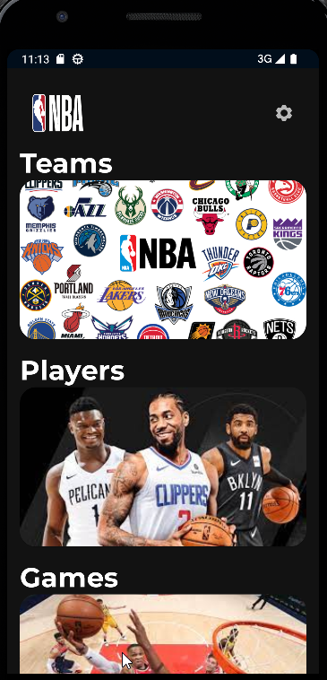
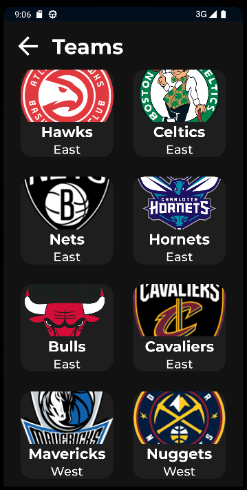
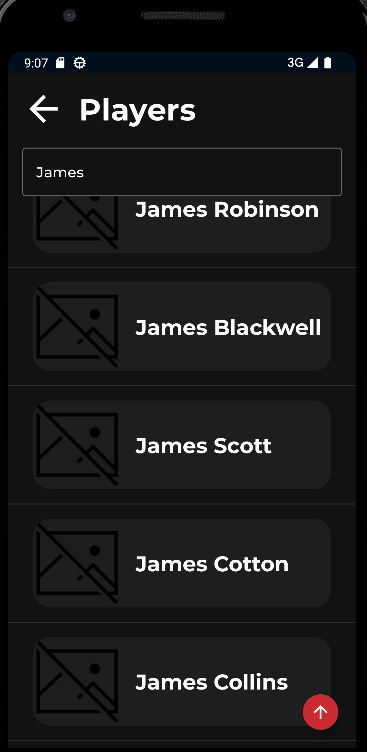

# Nba Clone App (Android Native Jetpack)

App creada en Android nativo usando XML y los componentes de arquitectura Jetpack. Para poder mostrar los últimos equipos, jugadores y juegos de la NBA.
Se usa el patrón de diseño recomendado por Google MVVM, y la micro-arquitectura Clean Architecture.

## Screenshots

### Kit de herramientas del proyecto

- Inyección de dependencias (Dagger Hilt)
- Splash Screen.
- SwipeRefreshLayout.
- Base de datos local (Room y SQLite)
- Navegación entre fragmentos (Navigation Jetpack)
- Paging3 (Paginacion y busqueda).
- Paging3 (RemoteMediator, uso de la capa de datos local y remota para la paginación *Modo experimental*).
- Interfaz creada usando XML y Material Design.
- Configuración de temas Dark y Light.
- Uso de corrutinas nativo en Kotlin y livedata.
- Uso de capa de presentacion usando casos de uso.
- Capa de datos usando Datasources.
- Pruebas unitarias.